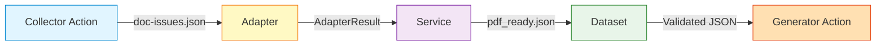
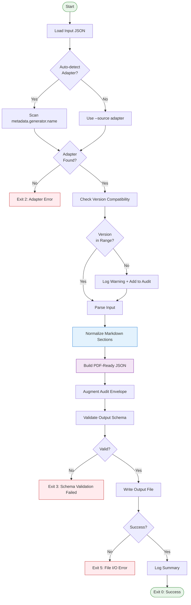
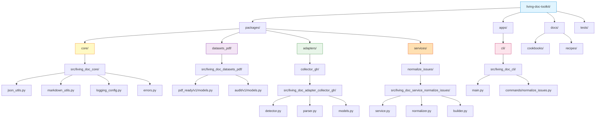
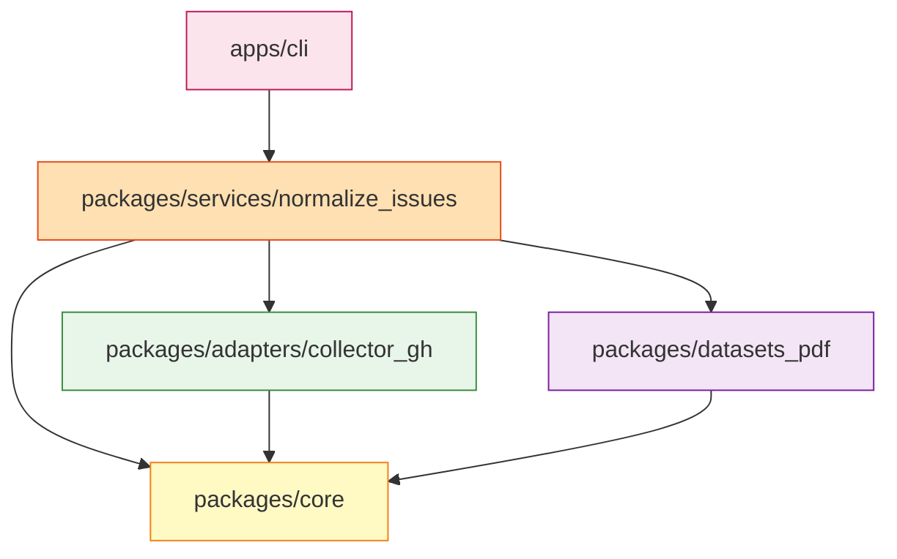
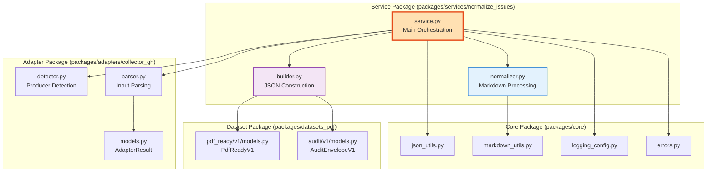
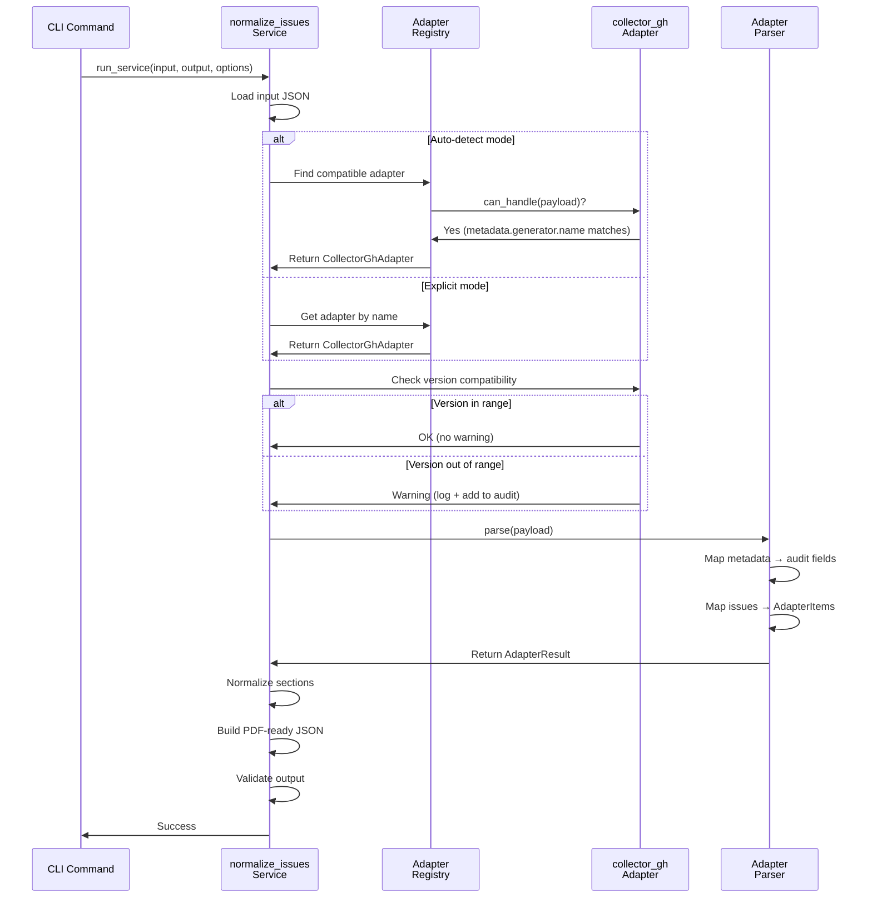
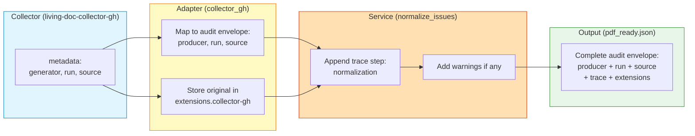
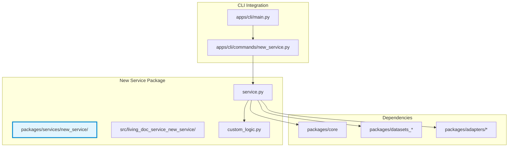
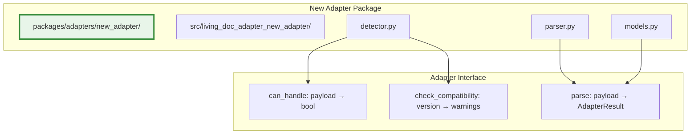
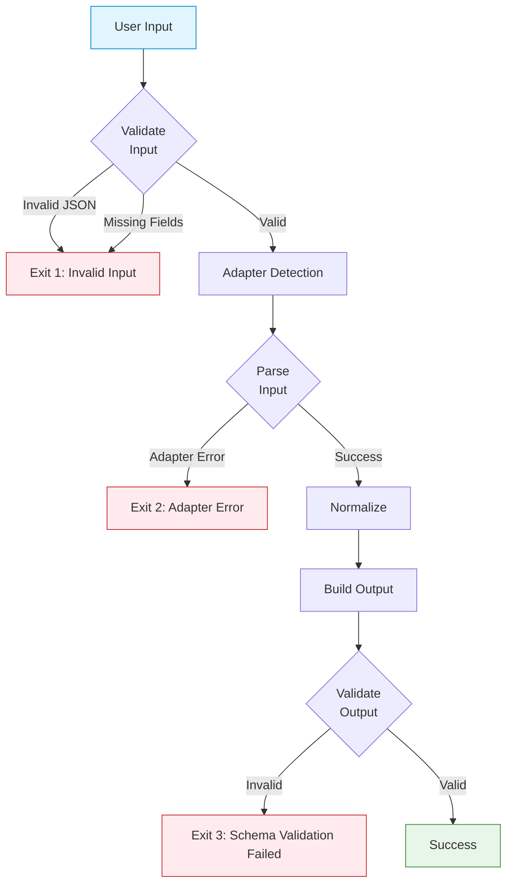

# Architecture Overview

**Version:** 1.0  
**Last Updated:** 2026-02-18

---

## Table of Contents

1. [System Overview](#system-overview)
2. [Data Flow Pipeline](#data-flow-pipeline)
3. [Monorepo Package Structure](#monorepo-package-structure)
4. [Service Architecture](#service-architecture)
5. [Adapter Pattern](#adapter-pattern)
6. [Audit Trail Flow](#audit-trail-flow)

---

## System Overview

The Living Documentation Toolkit is a **generic builder** that transforms machine-readable artifacts from upstream collectors into canonical datasets for downstream generators. It is designed as a modular, extensible monorepo with clear separation of concerns.

**Core Principles:**
- **Adapter-driven input detection**: Auto-detect producer format
- **Versioned contracts**: JSON Schema + Pydantic models
- **Enterprise-grade audit**: Preserve provenance throughout the pipeline
- **Fail-safe compatibility**: Warn and attempt processing for version mismatches
- **Deterministic output**: Same input always produces same output

---

## Data Flow Pipeline

### High-Level Pipeline (SPEC.md §5.1)



**Pipeline Stages:**

1. **Collector Action** (`AbsaOSS/living-doc-collector-gh`)
   - Collects issues from GitHub
   - Outputs: `doc-issues.json`

2. **Adapter** (`packages/adapters/collector_gh`)
   - Detects producer format
   - Parses input into internal representation
   - Outputs: `AdapterResult`

3. **Service** (`packages/services/normalize_issues`)
   - Normalizes markdown sections
   - Builds canonical JSON structure
   - Outputs: `pdf_ready.json`

4. **Dataset** (`packages/datasets_pdf`)
   - Validates output against schema
   - Ensures compliance with generator contract

5. **Generator Action** (`AbsaOSS/living-doc-generator-pdf`)
   - Generates PDF document
   - Outputs: `living-documentation.pdf`

---

### Detailed Service Pipeline



---

## Monorepo Package Structure

### Directory Layout (SPEC.md §4.1)



### Package Dependencies



**Dependency Rules:**
- **Core** has no dependencies (lowest level)
- **Datasets** depends only on Core
- **Adapters** depend on Core
- **Services** depend on Core, Datasets, and specific Adapters
- **CLI** depends on Core and specific Services

---

## Service Architecture

### Normalize-Issues Service Components



**Component Responsibilities:**

- **service.py**: Main orchestration logic, pipeline coordination
- **normalizer.py**: Markdown parsing and section mapping
- **builder.py**: PDF-ready JSON structure construction
- **Core utilities**: Reusable helpers (JSON I/O, logging, markdown parsing)
- **Adapter**: Input detection and parsing
- **Dataset models**: Schema validation and type safety

---

## Adapter Pattern

### Adapter Selection and Execution



**Key Concepts:**

1. **Detection**: Adapters implement `can_handle(payload)` to identify compatible inputs
2. **Version Checking**: Adapters define confirmed compatible ranges
3. **Parsing**: Adapters translate external format to internal `AdapterResult`
4. **Extensibility**: New adapters can be added without modifying services

---

## Audit Trail Flow

### Audit Envelope Augmentation



**Audit Trail Example:**

```json
{
  "meta": {
    "audit": {
      "schema_version": "1.0",
      "producer": {
        "name": "AbsaOSS/living-doc-collector-gh",
        "version": "1.2.0",
        "build": "abc123"
      },
      "run": {
        "run_id": "123456",
        "run_attempt": "1",
        "actor": "user@example.com",
        "workflow": "collect-docs",
        "ref": "refs/heads/main",
        "sha": "abc123def456"
      },
      "source": {
        "systems": ["GitHub"],
        "repositories": ["AbsaOSS/project"],
        "organization": "AbsaOSS",
        "enterprise": null
      },
      "trace": [
        {
          "step": "collection",
          "tool": "living-doc-collector-gh",
          "tool_version": "1.2.0",
          "started_at": "2026-02-18T10:25:00Z",
          "finished_at": "2026-02-18T10:28:00Z",
          "warnings": []
        },
        {
          "step": "normalization",
          "tool": "living-doc-toolkit",
          "tool_version": "0.1.0",
          "started_at": "2026-02-18T10:30:00Z",
          "finished_at": "2026-02-18T10:30:05Z",
          "warnings": [
            {
              "code": "VERSION_MISMATCH",
              "message": "Producer version 2.1.0 is outside confirmed range",
              "context": "metadata.generator.version"
            }
          ]
        }
      ],
      "extensions": {
        "collector-gh": {
          "original_metadata": {
            "generator": {...},
            "run": {...},
            "source": {...}
          }
        }
      }
    }
  }
}
```

**Audit Benefits:**
- **Provenance**: Track data origin and transformations
- **Reproducibility**: Recreate output with same input and tools
- **Debugging**: Identify which step introduced issues
- **Compliance**: Enterprise audit requirements
- **Extensibility**: Custom metadata via extensions

---

## Extension Points

### Adding a New Service



**Steps to Add a New Service:**

1. Create service package: `packages/services/{service_name}/`
2. Define service logic in `service.py`
3. Add dependencies (core, datasets, adapters)
4. Write unit tests
5. Create CLI command in `apps/cli/commands/{service_name}.py`
6. Register command in `apps/cli/main.py`
7. Add cookbook and recipes to `docs/`

---

### Adding a New Adapter



**Steps to Add a New Adapter:**

1. Create adapter package: `packages/adapters/{adapter_name}/`
2. Implement `detector.py` with `can_handle()` and `check_compatibility()`
3. Implement `parser.py` with `parse()` returning `AdapterResult`
4. Define `models.py` for adapter-specific types
5. Write unit tests with fixture files
6. Register adapter in service adapter registry
7. Update documentation with supported formats

---

## Performance Considerations

### Expected Performance (SPEC.md §5.5)

| Input Size | Target Time | Maximum Time |
|------------|-------------|--------------|
| 10 issues | < 1 second | 3 seconds |
| 100 issues | < 10 seconds | 30 seconds |
| 1000 issues | < 60 seconds | 180 seconds |

**Performance Bottlenecks:**
- JSON parsing (large files)
- Markdown normalization (complex content)
- Schema validation (large datasets)

**Optimization Strategies:**
- Streaming JSON parsing for large files
- Parallel markdown processing
- Caching compiled schemas

---

## Security Considerations

### Input Validation



**Security Measures:**
- Input validation at adapter level
- Schema validation at output level
- No code execution from input data
- No network requests during processing
- Deterministic output (no side effects)

---

## Additional Resources

- **SPEC.md**: Full system specification
- **TASKS.md**: Implementation roadmap
- **Cookbook**: `docs/cookbooks/normalize-issues.md`
- **Recipes**: `docs/recipes/`
- **Troubleshooting**: `docs/troubleshooting.md`
